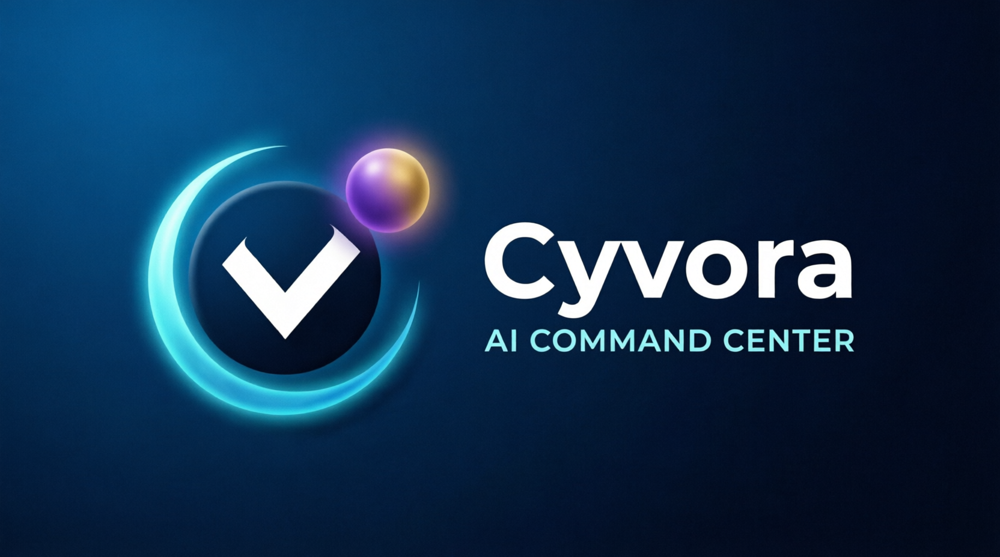

# Cyvora AI Command Center

<p align="center">
  
</p>

Cyvora is an AI Command Center for founder-led operations: an operating system for turning objectives into companies, departments, teams, agents, tasks, connectors, and outputs.

The visual language intentionally combines skeuomorphic extrusion with restrained glass overlays so the interface feels physical, premium, and operational rather than decorative.

Cyvora uses Space Grotesk for the primary UI voice and JetBrains Mono for system data, logs, and execution detail.

## What this project does

- captures a business objective from the founder
- previews the generated operating structure before execution
- requires approval before the build or mission can start
- supports a local-only free mode for development and testing
- keeps the UI focused on hierarchy, execution, and control

## Access and monetization model

Cyvora is designed so the founder and builder can use it locally for free while the product evolves.

- Local mode: free for founder and builder use
- Public demo mode: free, seeded, read-only, resettable
- Builder tier: paid hosted access with stronger harness controls
- Operator tier: paid production access with multi-company support and auditability
- Enterprise tier: custom deployment, SLA, and dedicated runtime

The monetization model is based on infrastructure, safety, and production capacity rather than generic AI chat.

## Documentation as trust signal

In Cyvora, documentation is not just a developer reference. It is evidence that the system is safe, auditable, and maintainable.

- The vision document defines the operational model.
- The README explains the user-facing intent and runtime modes.
- The deployment notes explain where execution lives and how it is gated.
- The roadmap documents what remains before production.

## Run locally

```bash
npm install
npm run dev
```

Open `http://localhost:3003` in your browser if the local server is running on the canonical Cyvora port.

## Free local Codex mode

If you want to use Codex without OpenAI billing on your own machine, run:

```bash
npm run codex:free -- "your prompt here"
```

The first run may download a local model into Ollama. After that, it stays local to your machine.

## Project notes

- The app is designed to run in local, demo, and later production modes.
- The public demo mode is read-only.
- Approval gates are intentionally required before execution.
- The remaining production work is tracked in [PRODUCTION_ROADMAP.md](./PRODUCTION_ROADMAP.md).
- The first production deployment path and worker loop are documented in [DEPLOYMENT_FLYIO.md](./DEPLOYMENT_FLYIO.md).
- The current product direction is documented in [VISION_AI.md](./VISION_AI.md).

## Static GitHub Pages showcase

GitHub Pages publishes **one canonical static file only**:

```text
docs/cyvora-full-app-showcase.html
```

The Pages workflow copies that file to the deployed artifact as `index.html`. The file contains both:

- a premium public landing screen
- the fully mocked interactive product tour

The public landing screen offers two clearly separated actions:

- **Explore the Mock App** — enters the static interactive showcase
- **Unlock / Sign In** — opens the separately hosted Cyvora application at `https://cyvoraai.fly.dev/unlock`

GitHub Pages never receives or processes:

- access codes or passwords
- authentication cookies
- API keys or provider secrets
- database records
- tenant files
- worker controls
- live API routes
- billing or connector actions

The full Next.js application remains in the repository and is deployed separately. The Pages artifact contains only static, public-safe content.

To preview the canonical showcase locally:

```bash
python3 -m http.server 8080 --directory docs
```

Then open:

```text
http://localhost:8080/cyvora-full-app-showcase.html
```

## Learn more

- [Next.js documentation](https://nextjs.org/docs)
- [Next.js deployment docs](https://nextjs.org/docs/app/building-your-application/deploying)


## Phase 4 and Phase 5

Cyvora now includes premium operating-system controls and a deterministic, zero-cost Executive AI blueprint workspace at `/executive-ai`. See `PHASE_4_5_OS_AND_EXECUTIVE_AI.md`.
